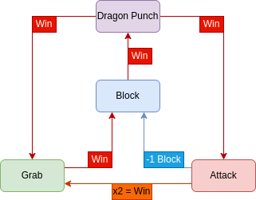

# Specification

Adversarial turn-based game inspired by the fighting game Footsies.

## Basic rules

A round happens in successive turns, where each of the players select an option. How the options interact determines whether the game continues for another turn, or ends with one of the players winning. Playing the game can happen over multiple rounds or a single one.

## Actions

There are four possible options available at the start of the game : 
- Attack
- Block
- Grab
- Dragon Punch

Block is limited to three uses per round against Attacks, as will be covered in the next section.

## Interaction

Interaction can be summarized by this chart:



Attack wins only against Grabs, and if a player lands two attacks in succession, they win. If the opponent Blocks, the game continues and one use of Block is deducted from them. If the opponent Dragon Punches, the player loses.

Block completely stops both Attacks and Dragon Punches. If the opponent Attacks, the game continues, and one use is consumed, out of three per round. If the opponent Dragon Punches, the player counters it and wins. If the opponent grabs, the player loses.

Grab wins only against Block, and will instantly grant a win. As mentioned earlier, Grabs lose to attacks, and if hit twice, the player loses.

Finally, Dragon Punches are special attacks that win instantly against Attacks and Grabs, and lose instantly to Blocks.

# Implementation

The game is implemented inside the `game.py` file, then experimented on in the `footsies.ipynb` notebook.

## Problems encountered

### Nash Player

One of the first strategies we tried to implement as a simple solution was establishing a Nash Equilibrium, a set of probabilities for each move calculated using linear programming from what's called a payoff matrix. To be more specific, a Nash Equilibrium is a set of stragegies for both players from which neither would want to deviate.

In our case, the obtained payoff matrix looked like this :
```py
np.array([
    [  0,  1, -1,  1],   # Attack       vs (Attack, Block, Grab, Dragon Punch)
    [ -1,  0,  1, -1],   # Block        vs (Attack, Block, Grab, Dragon Punch)
    [  1, -1,  0,  1],   # Grab         vs (Attack, Block, Grab, Dragon Punch)
    [  1, -1,  1,  0],   # Dragon Punch vs (Attack, Block, Grab, Dragon Punch)
])
```

In terms of game theory, it is considered "degenerate" : There exists situations in which two responses could be best. This is why it's considered a bluffing game, since if our game had a designated best option for every other option, it would amount to rock-paper-scissors (with an extra choice). However, as we weren't aware before digging deeper, this actually makes the computation of a Nash Equilibrium impossible, since in most situations, players will want to change up their options. As such, we dropped this player type.